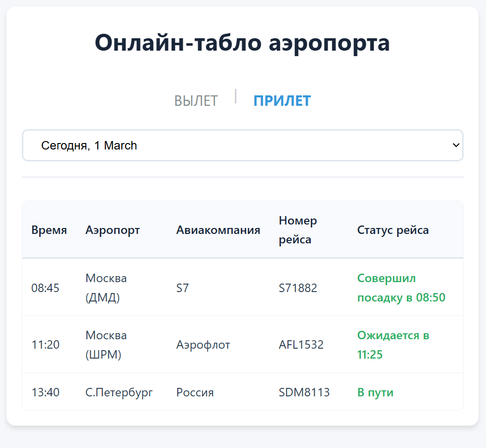

# airport-test-task
# Онлайн-табло аэропорта

Веб-приложение "Онлайн-табло аэропорта" на PHP 8 с MySQL. Отображает актуальную информацию о вылетающих и прибывающих рейсах с возможностью фильтрации по дате.

## Функционал

- Просмотр рейсов на **Вчера**, **Сегодня**, **Завтра**
- Переключение между табло **ВЫЛЕТ** и **ПРИЛЕТ**
- Хранение данных в базе MySQL
- Адаптивный дизайн для мобильных устройств

## Стек

- **PHP 8.0+**
- **MySQL 5.7+ / MariaDB**
- **HTML5, CSS3**
- **PDO** для работы с базой данных
